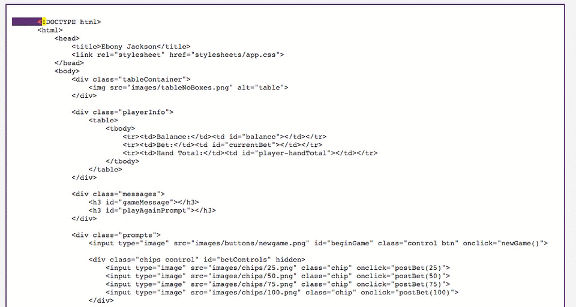
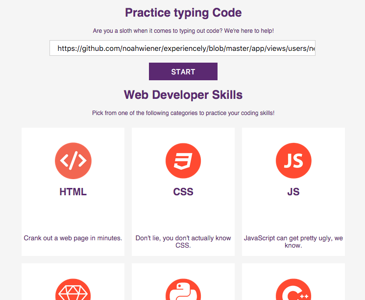
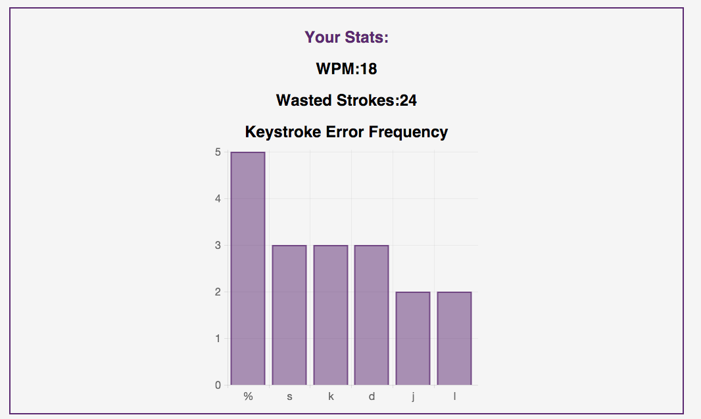

# TeamHACK1N
DBC Hackathon Project

[Live link][live]

[live]: http://hack1n-slash.herokuapp.com/

## Concept

HACK1N-Slash is a typing demo that tracks a user's typing speed and accuracy.  In order to practice typing in a user's language of choice, users can paste URLs from any project on github, and test their typing in that file format.  When they complete the file or are done typing, the app displays details on typing speed and accuracy, including a chart of their most frequently missed characters.

## Take a Look Inside the App

